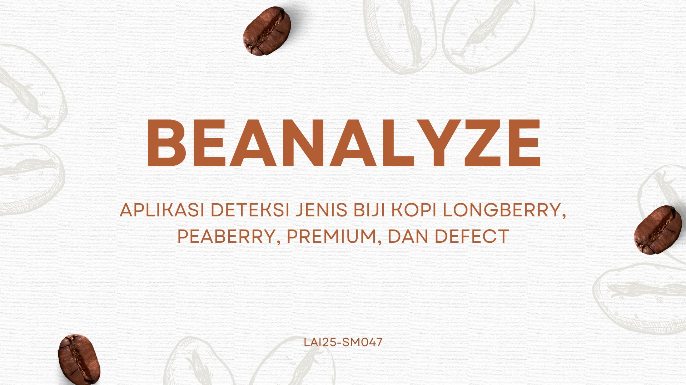

# ☕ Beanalyze - Aplikasi Deteksi Jenis Biji Kopi Longberry, Peaberry, Premium, dan Defect
  

Beanalyze adalah aplikasi berbasis Android yang menggunakan model YOLOv11 untuk mendeteksi dan mengklasifikasi jenis biji kopi secara otomatis dan efisien.

## 📱 Fitur Aplikasi

- **Deteksi Biji Kopi Otomatis**  
  Menggunakan YOLOv11 untuk mengenali empat jenis biji kopi:
  - Longberry
  - Peaberry
  - Premium
  - Defect (biji rusak)

- **Model Switching Otomatis**  
  Jika YOLOv11 gagal melakukan deteksi, sistem secara otomatis beralih ke model cadangan YOLOv5 yang lebih stabil.

- **Deskripsi Otomatis**  
  Setelah deteksi berhasil, aplikasi akan menampilkan deskripsi singkat mengenai karakteristik jenis biji kopi tersebut.

- **Antarmuka Sederhana & Mudah Digunakan**  
  Siapapun dapat menggunakan aplikasi tanpa latar belakang teknis.

---

## 🚀 Cara Menggunakan Aplikasi

1. **Install APK:**
   - Unduh APK secara manual.
   - Aktifkan "Sumber Tidak Dikenal" di pengaturan Android.
   - Instal aplikasi.

2. **Gunakan Aplikasi:**
   - Buka aplikasi di perangkat Android.
   - Unggah gambar biji kopi dari galeri atau kamera.
   - Tunggu hasil deteksi muncul.
   - Lihat jenis biji kopi dan persentase kepercayaan model.
  
https://github.com/alkifani/Beanalyze/blob/main/video%20demo%20aplikasi.mp4

---

## 🚀  Team : LaskarAi Capstone Team "Beanalyze" LAI25-SM047

| Name                        | Cohort ID   | University        | Status |
| --------------------------- | ------------ | ----------------- | ------ |
| Adinda Aulia Hafizha Nasution | A295XBF012  | Universitas Pembangunan Nasional Veteran Jakarta | Active |
| Alifina Aulia Azzahra          | A180XBF049  | Universitas Airlangga | Active |
| Ahmad Mufadhdhal Alkifani    | A322YBF029  |  Universitas Syiah Kuala | Active |
| Kornelius Setiawan          | A013YBF250  | Universitas Terbuka | Active |

